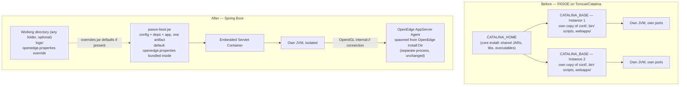

# Bringing AI Capabilities to PASOE

*A Spring Boot–native evolution of the PASOE web tier*

---

## 1. What changed: PASOE moves off Tomcat/Catalina, onto Spring Boot

**Before — per Progress's own PASOE architecture docs**
- `CATALINA_HOME` — the core PAS for OpenEdge install (e.g. `.../servers/pasoe`): shared JARs, libraries, executables, used by *every* instance on the host.
- `CATALINA_BASE` — the root directory of one **instance**, created via `tcman create`:
  - own **copy** of `conf/` (properties, config files)
  - own **copy** of some `bin/` scripts (start/stop/deploy/tcman)
  - own `webapps/`, `work/`, `logs/`, `temp/`
- Each instance runs its **own JVM**, own ports, own config — but still depends on the shared `CATALINA_HOME` for core Tomcat libraries.
- One host → one `CATALINA_HOME`, potentially **many** `CATALINA_BASE` instances.
- Net effect: config/scripts are physically duplicated per instance; only the core libraries are shared by reference.

**After**
- Executable **jar**, embedded servlet container
- `java -jar pasoe-boot.jar` — no `CATALINA_HOME`/`CATALINA_BASE` split at all
- Config, dependencies, and app in a single artifact — defaults (e.g. `openedge.properties`) ship **inside** the jar
- Optional external **working directory** — any folder — to override those defaults and hold logs, without touching the jar itself
- One process, one JVM, one classpath — per app, not shared
- The OpenEdge **AppServer agent** (ABL runtime) is still a separate process, launched from the OpenEdge **install directory** — Spring Boot doesn't replace it, it replaces the Tomcat/Catalina layer that used to sit in front of it

*(Source: Progress documentation — "Overview of instances in PAS for OpenEdge" and "Catalina environment variables", documentation.progress.com.)*

## 2. Why this is better — Tomcat/Catalina vs. Spring Boot

| | Tomcat/Catalina (CATALINA_HOME + CATALINA_BASE) | Spring Boot |
|---|---|---|
| Deployment unit | WAR, deployed into a `CATALINA_BASE` instance | Single executable jar |
| Config | Copied into each instance's own `conf/` at creation time | One `application.yml`, travels with the artifact |
| Isolation | Own JVM per instance, but core libs shared from `CATALINA_HOME` | One JVM per app, nothing shared |
| Startup | `CATALINA_HOME` + instance startup sequence | App only — faster cold start |
| Versioning | All instances constrained by the one `CATALINA_HOME` version | App pins its own Boot/Spring/servlet versions independently |
| Local dev | Requires a running container/instance | `java -jar` or IDE run — no container install |
| Cloud/container fit | Needs a Tomcat base image + WAR/instance setup | Jar *is* the container image payload |
| Ops surface | Core server + per-instance admin, two layers | One process to monitor, one to restart |

**Bottom line:** one less moving part, one less thing to patch, one less version matrix to manage.

## 3. AI capabilities added on top

| Capability | What it is | Status |
|---|---|---|
| **In-memory vector store** | `SimpleVectorStore`, local ONNX embeddings — top-K semantic search, **no LLM required for this piece** | ✅ built |
| **Swappable backend** | Same `VectorStore` interface — drop in Chroma, Pinecone, pgvector later with no tool-layer changes | design-ready |
| **Natural-language data query tools** | Tools that discover schema and query OpenEdge tables via the existing REST forwarding pipeline — in-process, no extra network hop | ✅ built (demo) |
| **MCP server** | Exposes the above tools over stdio — any MCP-capable client (GitHub Copilot demoed here) can discover and call them | ✅ built |
| **MCP client** | Would let PASOE itself call *out* to an LLM (OpenAI/Anthropic/etc.) for its own reasoning | ⏳ not in this demo — requires external LLM connectivity/API key, deliberately out of scope to keep this key-free |
| **Natural-language ops/management tools** | Agent state, session pool health, troubleshooting — today exposed via JMX only | 💡 proposed next step, same tool pattern as the data-query demo |

**Key point:** the vector store + tools work today with **zero LLM API keys** on the PASOE side. The LLM lives entirely in the consuming client (Copilot). This is what makes it demoable without any vendor commitment.

## 4. Spring AI stack used

| Layer | Component | Role |
|---|---|---|
| Tool exposure | `@Tool` / `@ToolParam` (`spring-ai-core`) | Annotate plain Java methods as callable tools — no protocol-specific code in the tool logic itself |
| MCP server | `spring-ai-starter-mcp-server` | Registers `@Tool` beans over MCP, stdio transport |
| Tool registration | `ToolCallbackProvider` / `MethodToolCallbackProvider` | Bridges annotated methods → MCP tool callbacks (`McpToolsConfig`) |
| Embeddings | `spring-ai-starter-model-transformers` (`TransformersEmbeddingModel`) | Local ONNX inference — default model `sentence-transformers/all-MiniLM-L6-v2`, bundled in-jar, no API key, no network call |
| Vector store | `spring-ai-vector-store` (`SimpleVectorStore`) | In-memory similarity search — same `VectorStore` interface as pgvector/Chroma/Pinecone, swappable later with no tool-layer changes |
| Document ingestion | `TextReader`, `TokenTextSplitter` | Loads and chunks the source document before embedding |

**Notably absent:** any `spring-ai-starter-model-openai`/`-anthropic`/etc. This app holds **no LLM API key at all** — it only exposes tools and does local embedding-based search. The reasoning model lives entirely on the consuming side.

## 5. The agent loop is swappable — Copilot is just what's plugged in today

This demo uses **GitHub Copilot CLI** as the MCP client because it was the fastest path to a working demo, not because the tools are Copilot-specific. Anything that speaks MCP can plug into the exact same server with zero changes on the PASOE side:

- **Claude Code** — same stdio MCP registration pattern
- **Any other agentic coding/chat tool with MCP client support** — the ecosystem is converging on MCP as the common integration point
- **A home-grown agent loop** — e.g. a LangGraph graph (or Spring AI's own `ChatClient` + `Advisor` loop) that connects to this server as an MCP client and drives its own reasoning
- **Anthropic/OpenAI/etc. directly** — if this app later adds an MCP *client* dependency (as noted in section 3), it could hold its own LLM connection instead of relying on an external agent host altogether

The point: **the tool surface (query, discovery, policy search) is reusable infrastructure, independent of which model or agent framework ends up calling it.**

## 6. Where the industry is headed

- Spring Boot is described as the dominant enterprise Java framework going into 2026, with cloud-native deployment as a primary driver of new adoption.
- Enterprise Java survey data (Azul State of Java, OpenLogic State of Open Source) shows accelerating movement toward containerized, self-contained deployment models and away from shared, version-pinned application servers — cited as a top source of upgrade friction and technical debt in traditional Tomcat/Catalina setups.
- MCP (Model Context Protocol) emerged in late 2024 and has since been adopted as a common integration point across major AI coding assistants and IDEs — the same pattern this demo uses to expose PASOE tools.

*(No single published statistic isolates "% of Tomcat/WAR shops that migrated to Spring Boot" — the data above are the closest available industry signals, not a direct measurement of that specific migration.)*

## 7. Suggested next steps

1. Expand tool set to JMX-backed management operations (agent state, session pool, troubleshooting) — same pattern as the data-query tools.
2. Swap `SimpleVectorStore` for a persistent store once real documents (not a demo policy file) are in scope.
3. Evaluate adding an MCP **client** if/when there's appetite for PASOE itself to hold an LLM API key.
4. Expand MCP transport to HTTP/SSE if a non-Copilot, always-on consumer shows up.